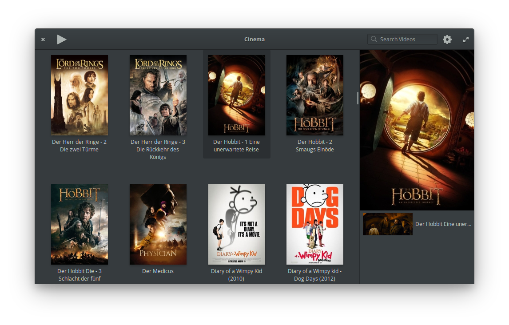
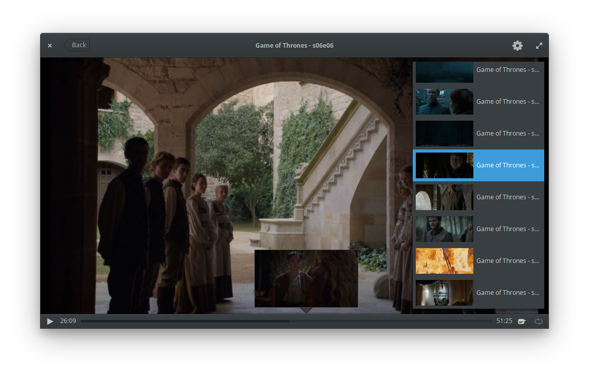

<div>
  <h1 align="center">Cinema</h1>
  <h3 align="center"><br>A video player for watching local video files</h3>
  <p align="center">Designed for <a href="https://elementary.io"> elementary OS</p>
</div>

[](https://travis-ci.org/artemanufrij/playmyvideos)

### Donate
<a href="https://www.paypal.me/ArtemAnufrij">PayPal</a> | <a href="https://liberapay.com/Artem/donate">LiberaPay</a> | <a href="https://www.patreon.com/ArtemAnufrij">Patreon</a>

<p align="center">
  <a href="https://appcenter.elementary.io/com.github.artemanufrij.playmyvideos">
    
  </a>
</p>
<p align="center">
  
  <br/>
  
</p>

## Install from Github.
As first you need elementary SDK
```
sudo apt install elementary-sdk
```
Install dependencies
```
sudo apt install libsqlite3-dev libsoup2.4-dev libgstreamer-plugins-base1.0-dev libclutter-gtk-1.0-dev libclutter-gst-3.0-dev
```
Clone repository and change directory
```
git clone https://github.com/artemanufrij/playmyvideos.git
cd playmyvideos
```
Compile, install and start Cinema on your system
```
meson build --prefix=/usr
cd build
sudo make ninja
com.github.artemanufrij.playmyvideos
```
